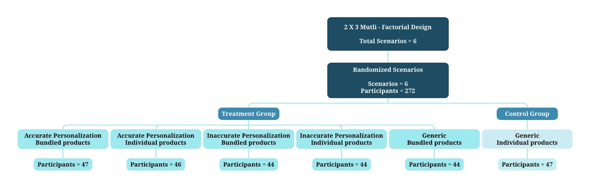
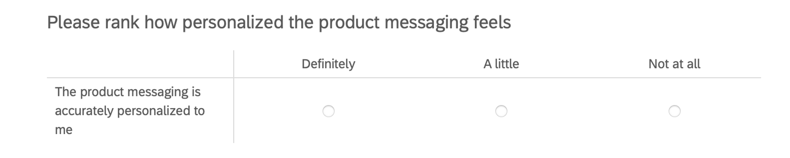
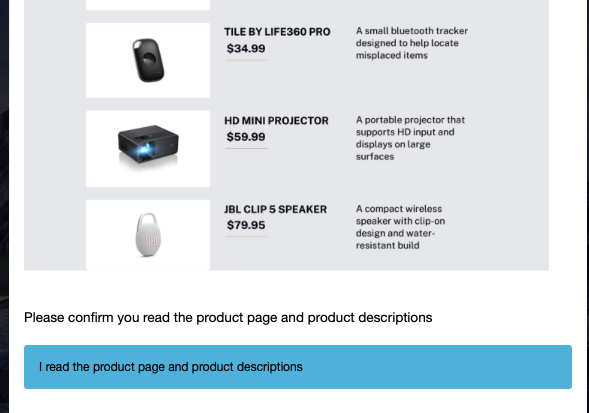

---
title: "Personalization and Bundling: How Message Fit and Product Framing Influence Spending"
output: 
  pdf_document:
    number_sections: true
    fig_caption: true
    latex_engine: xelatex
    keep_tex: true
header-includes:
  - \usepackage{pdflscape}
  - \usepackage{float}
  - \usepackage{caption}
  - \usepackage{subcaption}
  - \usepackage{adjustbox}
  - \usepackage{placeins} 
author: |
  \begin{tabular}{cc}
  Maia Kennedy & Indri Adisoemarta \\
  \emph{University of California, Berkeley MIDS} & \emph{University of California, Berkeley MIDS} \\
  \\
  Jane Li & Jordan Andersen \\
  \emph{University of California, Berkeley MIDS} & \emph{University of California, Berkeley MIDS} \\
  \end{tabular}
date: "`r format(Sys.time(), '%d %B %Y')`"
editor_options: 
  markdown: 
    wrap: 72
---

```{r setup, include=FALSE}
# General knitr options
knitr::opts_chunk$set(
  echo = FALSE,       # Hide R code
  warning = FALSE,    # Suppress warnings in PDF
  message = FALSE,    # Suppress package messages in PDF
  fig.align = "center",  # Center all figures
  #fig.pos = "htpb",     
  fig.width = 6,      # Default figure width
  fig.height = 4,     # Default figure height
  out.width = "80%"   # Scale figures for a clean look
)

# Load needed packages quietly
suppressPackageStartupMessages({
  library(data.table)
  library(broom)
  library(ggplot2)
  library(lmtest)
  library(sandwich)
  library(stargazer)
  library(dplyr)
  library(forcats)
  library(knitr)
  library(pROC)
  library(stringr)
  library(patchwork)
})
```

```{r read data}
# read the data (replace with your file name)
d_qualtrics <- fread('qualtrics_purespectrum.csv')
d_friendsfamily <- fread('qualtrics_friendsfamily.csv')

# concat datatables
# remove first 2 rows from friendsfamily
d_friendsfamily <- d_friendsfamily[-c(1, 2)]

d <- rbindlist(list(d_qualtrics, d_friendsfamily), fill=TRUE) 

# make duplicate column names unique
setnames(d, make.names(names(d), unique = TRUE))
```

```{r clean data}
# clean the data
d[, confirmation := paste0(Q115, Q114, Q112, Q110, Q104, Q105, Q106, Q102, Q100, Q97, Q95, Q94)]
d[, personalization := paste0(Q55_1, Q67_1, Q21_1, Q59_1, Q57_1, Q61_1, Q63_1, Q65_1, Q71_1, Q73_1, Q75_1, Q69_1)]

# create list of purchase cols
purchase_cols <- c("Q56", "Q82", "Q22", "Q60", "Q58", "Q62", "Q64", "Q82.1", "Q82.2", "Q82.3", "Q82.4", "Q82.5")
d[, purchases := do.call(paste0, .SD), .SDcols = purchase_cols]
```

```{r extract purchase amounts}
# extract purchase amounts from purchases

d[, purchase_amount := sapply(purchases, function(text) {
  amounts <- str_extract_all(text, "\\(\\$([0-9]+\\.[0-9]{2})\\)")[[1]]
  nums <- as.numeric(str_replace_all(amounts, "[\\(\\)\\$]", ""))
  sum(nums, na.rm = TRUE)
})]
```

```{r parse lifestyle scores}
# create columns for max lifestyle value and top lifestyle
lifestyle_cols <- c("TravelScore", "FitnessScore", "FamilyScore", "WorkScore", "LeisureScore")
d[, top_lifestyle := lifestyle_cols[max.col(.SD, ties.method = "first")], .SDcols = lifestyle_cols]
# Get the max value itself
d[, max_lifestyle_value := do.call(pmax, .SD), .SDcols = lifestyle_cols]
```

```{r subset columns}
# drop first two rows, keep only necessary columns
d <- d[-c(1, 2)]

d_subset <- subset(d, select=c("StartDate", "EndDate", "Status", "IPAddress", "Progress", "Duration..in.seconds.", "Finished", "RecordedDate", "ResponseId", "LocationLatitude", "LocationLongitude", "DistributionChannel", "UserLanguage", "Q_RecaptchaScore", "Age", "Gender", "Gender_4_TEXT", "Q15", "Q5", "Q7", "Q44", "Email.collection", "TravelScore", "FitnessScore", "FamilyScore", "WorkScore", "LeisureScore", "PresentationType", "CompleteFlag", "confirmation", "personalization", "purchases", "purchase_amount", "top_lifestyle", "max_lifestyle_value"))
```

```{r parse personalization and bundling}
# convert PresentationType into accurate, inaccurate, generic personalization and bundle, individual columns
d_subset[, accurate    := as.integer(grepl("Accurate", PresentationType))]
d_subset[, generic     := as.integer(grepl("Generic", PresentationType))]
d_subset[, inaccurate  := as.integer(grepl("Inaccurate", PresentationType))]
d_subset[, bundle      := as.integer(grepl("Bundle", PresentationType))]
d_subset[, individual  := as.integer(grepl("Individual", PresentationType))]
```

```{r remove preview observations}
# remove rows that are not anonymous (our test rows)
d_subset <- d_subset[d_subset$DistributionChannel=="anonymous"]
```

```{r create derived columns}
# purchase yes or no column
d_subset$if_purchase <-ifelse(d_subset$purchase_amount>0, 1, 0)

# Create column "if_confirm"
d_subset$if_confirm <- ifelse(d_subset$confirmation=="I read the product page and product descriptions", 1,0)

#create Personalization_Treatment column
d_subset <- d_subset %>% 
  mutate(Personalization_Treatment = sub("_.*", "", PresentationType))
```

```{r function for robust SE}
# Function to get robust SE safely
robust_se <- function(model) {
  sqrt(diag(vcovHC(model, type = "HC1")))
}
```

```{r stargazer landscape wrapper function, echo= FALSE}
sg_landscape <- function(...) {
  cat("\\clearpage\n\\begin{landscape}\n\\centering\n")
  on.exit(cat("\\end{landscape}\n\\clearpage\n"), add = TRUE)
  stargazer(
    ...,
    type = "latex",
    header = FALSE,
    font.size = "scriptsize",     # shrink a bit: tiny/scriptsize/small
    column.sep.width = "1pt",     # tighter inter-column spacing
    float = TRUE,
    table.placement = "p!"        # put on its own float page
  )
}
```


# Introduction

In digital commerce, personalization and product bundling are widely used strategies aimed at increasing consumer engagement and spending. This study investigates whether identity-based personalization enhances the effectiveness of product bundling in driving purchase behavior. Using a 3x2 factorial design, we randomly assigned 272 US-based participants into one of 6 conditions varying in personalization and bundling. We hypothesized that both personalization and bundling would independently increase total spending and that their combination would also produce a positive effect on spending. Contrary to expectations, we found no statistically significant differences in total purchase amounts across any of the treatment conditions. The findings contribute to the need for more nuanced understanding of the contextual and psychological factors that shape the effectiveness of digital marketing strategies. 

## Research question

**How does identity-based personalization influence the effectiveness of product bundling in driving consumer spending in an online retail context?** Specifically, we investigate whether the combination of personalization and bundling strategies increase total purchase amounts or influence individuals to make any purchase compared to non-personalized, non-bundled options.

## Justification

In today’s competitive digital commerce landscape, personalization and product bundling are two widely adopted strategies to enhance customer engagement and increase sales. While both tactics are effective independently, their combined impact on consumer behavior remains underexplored. Prior research has shown that personalization can increase perceived relevance and trust in recommendations (XinYun & Chun, 2024), while bundling strategies that align with consumer goals can increase overall purchase value (Rao et al., 2018). However, few studies have examined whether personalization enhances the perceived value and performance of product bundles. This research addresses that gap by testing whether identity-driven personalization amplifies the effectiveness of bundling in influencing real purchase behavior. The findings have important implications for marketing strategy, product recommendation systems, and the design of personalized user experiences in e-commerce platforms.

## Hypothesis

We test the following hypotheses:

- H1: Identity-based personalization (accurate matching to consumer profiles) increases total purchase amounts, regardless of bundling condition
- H2: Product bundling increases total purchase amounts, regardless of personalization condition
- H3 (Interaction Effect): The combination of accurate personalization and product bundling leads to higher purchase totals than either strategy alone, indicating a synergistic effect


# Experiment

## Comparison of Potential outcomes

The outcome measurements for this experiment will compare total simulated purchase amounts and whether a subject made a purchase (a binary outcome). To simulate real-world trade-offs in our outcome variables, each participant was given a fixed virtual budget of \$300 to spend or save during the shopping task. They were instructed that this was their total budget, and any combination of purchases and savings had to fit within it. They could choose to purchase any of the items appearing in the simulated environment, or, alternatively, they could choose to not purchase any of the items and save the \$300. The only variation across subjects is whether three of these products are bundled and the type of personalization messaging applied.  

We are comparing these outcomes across six randomly assigned groups, as indicated by the ROXO diagram in Table 1. These groups represent various combinations of the treatment conditions (Bundled, Accurate Personalization, Inaccurate Personalization), and the outcomes will be compared to determine how these treatments impact the likelihood and total amount of purchase. The groups will be as follows:

- Group 1 (R ):No bundle, no personalization 
- Group 2 (R, X1): Bundled, no personalization 
- Group 3 (R, X2): No bundle, Accurate Personalization 
- Group 4 (R, X3): No bundle, Inaccurate Personalization 
- Group 5 (R, X1,X2): Bundled, Accurate Personalization 
- Group 6 (R, X1, X3): Bundled, Inaccurate Personalization

The key comparison is between these groups to assess how different combinations of bundling and personalization treatments influence purchasing behavior. 

| Table 1. ROXO Diagram |   |   |
|:--------------------------:|---|---|
| Randomized Groups | Treatment | Outcome Measures |
|------------------|--------------|-----------------------|
| R |  | Total Purchase Amount \$, Any purchase (1=yes, 0=no) |
| R | X1 | Total Purchase Amount \$, Any purchase (1=yes, 0=no) |
| R | X2 | Total Purchase Amount \$, Any purchase (1=yes, 0=no) |
| R | X3 | Total Purchase Amount \$, Any purchase (1=yes, 0=no) |
| R | X1, X2 | Total Purchase Amount \$, Any purchase (1=yes, 0=no) |
| R | X1, X3 | Total Purchase Amount \$, Any purchase (1=yes, 0=no) |

## Treatment

This study employed a 3×2 factorial design, resulting in six total experimental conditions: three levels of personalization (accurate match, inaccurate match, and no personalization) crossed with two levels of bundling (bundled vs. non-bundled). Five of these conditions constituted treatment groups, while the sixth, no personalization and no bundling, served as a control. Participants were randomly assigned to one of the six conditions using Qualtrics' built-in randomization logic, with approximately equal allocation across groups. There were no technical deviations from the intended assignment. All participants received the correct product display and personalization message according to their assigned condition.

**Product Selection**

The shopping task featured six consumer technology products, selected for their broad appeal, gender neutrality, and price variability (ranging from \$24 to \$129). These products included:

- Apple AirPods 4 (\$129.00)
- Anker Portable Charger (\$54.99)
- Roku Streaming Stick 4K (\$46.99)
- Tile by Life360 Pro (\$34.99)
- HD Mini Projector (\$59.99)
- JBL Clip 5 Speaker (\$79.95)

For all participants, product listings included a brief description and use cases. In personalized conditions, messaging was framed to reflect the participant's assigned identity profile (e.g., family-oriented, frequent traveler). In bundled conditions, three of the six products, AirPods, Portable Charger, and Streaming Stick, were grouped together with a promotional “bundle” label and accompanying message, while the other three were shown individually. In the non-bundled condition, all six products were presented as individual options with no grouping. For samples of these product listings, refer to appendix A.

## Experimental Conditions

The six experimental groups were structured as follows:

| Table 2. Bundling X Personalization    |     |          |
|:----------------------------:|----------------------------|:----------- |
|                             | Bundled                     | Non-Bundled |
|---------------------------- |----------------------------- |----------- |
| Personalized Accurate   | Bundle (3) + 3 individual items | 6 items     |
| Personalized Inaccurate | Bundle (3) + 3 individual items | 6 items     |
| Non-Personalized     | Bundle (3) + 3 individual items | 6 items     |


 
```{r echo=FALSE, fig.show='hold', fig.align='center', fig.pos='H', fig.cap="Observation Tracking Flow Diagram"  }

```

**Validation of Treatment Perception & Diagnostic Checks**

To assess whether participants perceived the personalization manipulation as intended, we included a post-task perception check asking how personalized the product messaging felt. This served as a validation step to evaluate alignment between perceived and assigned personalization conditions.

```{r echo=FALSE, fig.align='center', fig.pos='H', fig.cap="Treatment perception check"}

```

Additionally, we included a post-task perception check to evaluate whether participants had read and internalized the product messaging. This took the form of an optional question asking participants to confirm they read product messaging. 

```{r echo=FALSE, fig.align='center', fig.pos='H', fig.cap="Compliance confirmation check"}

```

**Pre-Treatment**

Before exposure to any treatment, all participants completed a brief pre-task questionnaire designed to assess their lifestyle and consumer profile. The survey included a combination of text- and image-based questions, intended to simulate the kind of multidimensional data that modern e-commerce platforms often use to personalize recommendations. Participant responses were used to assign each individual to one of five predefined identity categories:

- Travel
- Family
- Fitness
- Work & Study
- Leisure

These categories were determined using backend logic, which scored each participant’s responses. In cases where participants matched equally across multiple profiles, one of the top-scoring categories was selected at random.

*Sample Profiling Question*

“When you have free time on a weekend, how are you most likely to spend it?”

- Exploring new places or taking short trips
- Exercising, going to the gym, or outdoor activities
- Spending time at home with family
- Catching up on work, studying, or learning something new
- Watching shows, playing games, or relaxing

This profiling process established the foundation for delivering identity-based personalization treatments.

### Personalization Treatment

Following profile assignment, participants were randomly assigned to one of three personalization conditions:

- Accurate Personalization: Messaging matched the participant’s assigned profile (e.g., a Work & Study profile received messaging emphasizing productivity use cases).
- Inaccurate Personalization: Messaging contradicted the participant’s assigned profile (e.g., a Family profile received Leisure-themed messaging).
- No Personalization (Control): Messaging was generic and did not reference any identity profile.

All personalized messages were applied at the product messaging level, with blurbs tailored to frame the use cases of the products in ways that aligned (or did not align) with the participant’s profile. To validate whether participants perceived the personalization as intended, a post-task perception check asked them to rate how personalized the messaging felt. 

### Bundling Treatment

Participants were also assigned to one of two bundling conditions:

- Bundled: Three of the six products were grouped together and presented with a promotional bundle label and messaging. The remaining three items were shown individually.
- Non-Bundled: All six products were presented individually, with no grouping or bundling cues.

Bundling was designed to test whether framing certain items as a package deal would influence purchase behavior relative to the same products shown separately.


### Participants and Recruitment

The unit of analysis in this study is individual participants. A total of 272 valid and complete responses were collected, with a 0% dropout rate. All participants were adults, primarily located in the United States, and were recruited using a mix of personal networks and paid sampling. Specifically:

- 70 participants were recruited through friends, family, and MIDS classmates, and
- 202 participants were recruited via the online survey platform PureSpectrum.

## Power Analysis

We test the power of our experimental design using a randomized
simulation where participants are randomly assigned to one of the 6
groups, with the no-bundle, no-personalization group representing the
control and the accurate personalization, bundle group being the main
outcome of interest. Our sharp null hypothesis states that the outcome
variable (purchase amount) will remain unchanged regardless of group
assignment. This simulation requires pre-determined assumptions of the
outcome variable. We define a base outcome under the sharp null
hypothesis, assuming a purchase amount of \$30. We then add random noise
drawn from a normal distribution with mean 0 and standard deviation 5.
The baseline amount of \$30 reflects the original pricing of low-budget
tech gadgets designed to appeal to a broad range of ages and genders.
For those in the treatment group, we assumed an increase in purchase
amount equivalent to the product of the base purchase amount and the
estimated effect size increased by 1:

  *outcome = purchase amount x (1 +  effect size)*

We then compare the effects of three hypothetical increases in purchase
amounts (5%, 10%, and 15%) when customers are exposed to accurate
personalization and bundling, relative to a baseline with no
personalization and no bundling. The test range of 5-15% is based on
prior research indicating that personalization can increase revenue by
10-15% (Arora et al., 2021). Evidence for the impact of bundling is
mixed, ranging from modest gains (1-2%) to negative effects.

The regression model for the randomized data shows significant results
for the accurate personalization, bundle group, with purchase amount
increasing by \$4. Results of the power analysis indicate that an effect
size of 15% could be detected with 250 participants with the study
powered at 89.7%, which is sufficiently above the 80% threshold required
for a well-designed experiment. Smaller effect sizes of 5% will be more
difficult to detect, requiring 2,000 participants to reach 77.8% power.
However, given that prior literature tends to report larger effects in
the range of 10–15% and considering budget limitations, we determined
that a sample size of 250 participants would be adequate for detecting
meaningful effects within this expected range, while maintaining a high
level of statistical power.

```{r define simulation parameters, include=FALSE, echo=FALSE}
n_simulations <- 1000
alpha <- 0.05
effect_sizes <- c(0.05, 0.10, 0.15)
sample_sizes <- c(100, 250, 500, 750, 1000, 2000)
```

```{r initialize results, echo=FALSE}
results <- data.table(expand.grid(
  n_subjects = sample_sizes,
  effect_size = effect_sizes
))
results[, power := NA_real_]
```

```{r create base data, echo=FALSE}
make_base_data <- function(n) {
  d_sim <- data.table(id = 1:n)
  
  # Create factor placeholders
  d_sim[, bundle := sample(c(0,1), .N, replace = TRUE)]
  d_sim[, personalization := sample(c("none", "accurate", "inaccurate"), .N, replace = TRUE)]
  
  # Create personalization factor
  d_sim[, personalization := factor(personalization, levels = c("none", "accurate", "inaccurate"))]
  
  # Create base outcome to be observed under sharp null hypothesis
  d_sim[, purchase_amt := 30 + rnorm(.N, mean = 0, sd = 5)]
  
  return(d_sim)
}
```

```{r run simulation loop, include=FALSE, echo=FALSE}
for (i in 1:nrow(results)) {
  n <- results$n_subjects[i]
  effect <- results$effect_size[i]
  p_values <- numeric(n_simulations)
  
  # Keep outcome the same for all simulations
  base_data <- make_base_data(n)
  
  for (sim in 1:n_simulations) {
    d_sim <- copy(base_data)
    
    # Conduct randomization across all groups (12)
    d_sim[, bundle := sample(c(0,1), .N, replace = TRUE)]
    d_sim[, personalization := sample(c("none", "accurate", "inaccurate"), .N, replace = TRUE)]
    d_sim[, personalization := factor(personalization, levels = c("none", "accurate", "inaccurate"))]
    
    # Create effect for a 3-way interaction (bundle × accurate personalization × discount)
    d_sim[bundle == 1 & personalization == "accurate",
      purchase_amt := purchase_amt * (1 + effect)]
    
    # Create linear regression model with all factors and combinations
    model_power <- lm(purchase_amt ~ bundle * personalization, data = d_sim)
    model_power_summary <- tidy(model_power)
    
    # Calculate p-values
    term <- "bundle:personalizationaccurate"
    p_values[sim] <- model_power_summary$p.value[model_power_summary$term == term]
  }
  
  # Estimate power
  results$power[i] <- mean(p_values < alpha, na.rm = TRUE)
}
```

```{r include=TRUE, echo=FALSE, results='asis'}
# Capture the LaTeX output
latex_output <- capture.output(
  stargazer(model_power,
            type = 'latex',
            title = 'Results: Simulated Randomization Inference Regression',
            dep.var.labels = 'Purchase Amount',
            font.size = "small")
)

# Filter out comment lines (starting with %)
clean_output <- latex_output[!grepl("^%", latex_output)]

# Print cleaned output
cat(paste(clean_output, collapse = "\n"))

#stargazer(model_power,
#          type = 'latex',
#          title = 'Results: Simulated Randomization Inference Regression',
#          dep.var.labels = 'Purchase Amount',
#          font.size = "small")
```


```{r include = TRUE, echo=FALSE, echo=FALSE, fig.show='hold', fig.align='center', fig.pos='H', fig.cap="Power to Detect 2-Way Interaction"  }
ggplot(results, aes(x = n_subjects, y = power, color = factor(effect_size * 100))) +
  geom_line(size = 1.2) +
  geom_point(size = 2) +
  geom_hline(yintercept = 0.8, linetype = "dashed", color = "red") + ### designate 80% threshold
  labs(
    title = "Power to Detect 2-Way Interaction",
    x = "Sample Size",
    y = "Estimated Power",
    color = "Effect Size (%)"
  ) +
 theme_minimal(base_size = 9) +
  theme(
     plot.title = element_text(face = "bold", hjust = 0.5, size = 12),
    legend.position = "bottom",
    legend.title = element_text(face = "bold"),
    plot.margin = ggplot2::margin(2, 2, 2, 2),
    panel.grid = element_blank()
   
  )
```

# Analysis

## Data

### Outcomes Measured

*Purchase Amount*

In our experiment, one of our measured outcomes is the simulated total purchase amount from our survey participants. As described earlier, participants are given a theoretical \$300 they can spend on any or all of the six tech-focused products they are shown. Depending on whether or not they fall into the bundling treatment, they are shown either a bundle option (which totals \$230.38) with 3 more options that are each \$34.99, \$59.99, or \$79.95 respectively, or 6 individual options. Both treatments have an option for the participant to spend \$0.00. The items are the same in each treatment and have the same prices. Examples of the purchase screen in our Qualtrics survey are shown in appendix B.

The mean purchase amount in our responses was \$`r round(mean(d_subset$purchase_amount, na.rm = TRUE), 2)`, with a median of \$`r round(median(d_subset$purchase_amount, na.rm = TRUE), 2)`. The min and max were \$`r round(min(d_subset$purchase_amount, na.rm = TRUE), 2)` and \$`r round(max(d_subset$purchase_amount, na.rm = TRUE), 2)` respectively. The standard deviation was \$`r round(sd(d_subset$purchase_amount, na.rm = TRUE), 2)`. The resulting purchase amounts are detailed in the histogram below.

*Binary Purchase Outcome*

A second outcome we measured was whether or not a participant made a purchase. If they made any purchase (greater than \$0.00 spent), they were marked as 1 for "any purchase". Otherwise, we marked them as 0 if they made no purchases. There were `r sum(d_subset$if_purchase == 1, na.rm = TRUE)` participants who made any purchase, and `r sum(d_subset$if_purchase == 0, na.rm = TRUE)` participants who made no purchase.


```{r include = TRUE, echo=FALSE, echo=FALSE, fig.show='hold', fig.align='center', fig.pos='H', fig.cap="Outcome distribution plots"  }
# Histogram
p <- ggplot(d_subset, aes(x = purchase_amount)) + 
  geom_histogram(fill = "darkslategray3", color = "white", binwidth = 20) +
  labs(title = "Purchase Amount Histogram", x = "Purchase Amount ($)", y = "Count") +
  theme_minimal(base_size = 9) +
  theme(
    plot.margin = ggplot2::margin(1, 0, 1, 0),
    panel.grid = element_blank(),
    plot.title = element_text(size = 12)
  )

# Binary outcome bar plot
p1 <- ggplot(d_subset, aes(x = factor(if_purchase))) +
  geom_bar(fill = "darkslategray3", color = "white") +
  geom_text(stat = 'count', aes(label = ..count..), vjust = -0.5, size = 2.5) +
  scale_x_discrete(breaks = c("0", "1")) +
  labs(
    x = "if_purchase",
    y = "Count",
    title = "Binary Outcome (0 = No, 1 = Yes)"
  ) +
  theme_minimal(base_size = 9) +
  theme(
    plot.margin = ggplot2::margin(0, 0, 0, 0),
    panel.grid = element_blank(),
    plot.title = element_text(size = 12)
  )

# Combine plots side by side with centered overall title
combined_plot <- p + p1

combined_plot
```

*Compliance Measure*

As a proxy for compliance in our treatment, we asked participants the following question: "Please confirm you read the product page and product descriptions". This question was optional, so participants did not have to answer this question with a confirmation. We used this as an attention check to identify the participants that "complied" in our experiment. "Compliance" means they fully read the descriptions, which implies they were making choices in the simulation that aligned with their real world buying choices.

In our survey, there were `r sum(!is.na(d_subset$confirmation) & d_subset$confirmation != "")` who answered our proxy compliance question with a confirmation, and `r sum(is.na(d_subset$confirmation) | d_subset$confirmation == "")` who did not confirm they read the descriptions.

```{r include = TRUE, echo=FALSE, echo=FALSE, fig.show='hold', fig.align='center', fig.pos='H', fig.cap="Compliance Measure"  }
# Create bar plot with factor x for discrete labels 0 and 1
p2 <- ggplot(d_subset, aes(x = factor(if_confirm))) +  # convert if_complied to factor
  geom_bar(fill = "darkslategray3", color = "white") +
  geom_text(stat = 'count', aes(label = ..count..), vjust = -0.5) +  # count labels above bars
  scale_x_discrete(breaks = c("0", "1")) +  # only show 0 and 1 on x-axis
  labs(
    x = "Complied",
    y = "Count",
    title = "Compliers (0 = did not confirm, 1 = confirmed)"
  ) +
   theme_minimal(base_size = 9) +
  theme(
    plot.title = element_text(size = 12, hjust = 0.5),    
    plot.margin = ggplot2::margin(2, 0, 2, 0),           # reduce plot height
    panel.grid = element_blank(),
    panel.background = element_rect(fill = "transparent", color = NA)
  )
p2

```

*Perceived Personalization Measure*

Additionally, we ran a check to confirm that the treatment assignment was consistent with participant perceptions. The result of this question indicated that 38% of those in the accurate personalization group reported that the messaging felt “definitely personalized,” compared to 27% in the generic (no-personalization) group and 24% in the inaccurate personalization group. While not a dramatic separation, these differences suggest that the manipulation was modestly successful in shaping perceived personalization.

```{r include = TRUE, echo=FALSE, echo=FALSE, fig.show='hold', fig.align='center', fig.pos='H', fig.cap="Perceived Personalization by Personalization Treatment"  }

#####PLOT 1#######################################################################################

d_subset <- d_subset %>% #create Personalization_Treatment column
  mutate(Personalization_Treatment = sub("_.*", "", PresentationType))

# Summarize counts and set factor levels
plot_data1 <- d_subset %>%
  group_by(Personalization_Treatment, personalization) %>%
  summarise(count = n(), .groups = "drop") %>%
  group_by(Personalization_Treatment) %>%
  mutate(
    percent = count / sum(count) * 100,
    percent_label = paste0(round(percent), "%"),
    personalization = fct_relevel(personalization,  "Definitely", "A little","Not at all")
  )

# Define colors for stacks as desired
colors <- c("Definitely" = "darkslategray3",
            "A little" = "darkslategray2",
            "Not at all" = "grey")

# Make sure the factor is ordered correctly before plotting
plot_data1$personalization <- fct_relevel(plot_data1$personalization, "Not at all", "A little", "Definitely")

# Plot
ggplot(plot_data1, aes(x = Personalization_Treatment, y = count, fill = personalization)) +
  geom_bar(stat = "identity") +
  geom_text(aes(label = percent_label), position = position_stack(vjust = 0.5), size = 3, color = "black") +
  scale_fill_manual(values = colors) +
  labs(
    title = "Perceived Personalization by Personalization Treatment",
    x = "Personalization Treatment",
    y = "Count of Total Individuals",
    fill = "Perceived Personalization"
  ) +
  coord_flip() +
  theme_minimal(base_size = 9) +
 theme(
    plot.title = element_text(size = 12, hjust = 0.5), 
    plot.margin = ggplot2::margin(3, 3, 3, 3),  # explicitly ggplot2 margin
    panel.grid = element_blank(),
 
         panel.background = element_rect(fill = "transparent", color = NA)
  )
```

### Covariate Features

In our survey, our covariate features are age, gender, and income level. These are collected via questions asked before the randomization treatment occurs. The distribution of our covariate features are displayed in the following figure.


```{r include = TRUE, echo=FALSE, echo=FALSE, fig.show='hold', fig.align='center', fig.pos='H', fig.cap="Covariate Features Plots"  }

# create a list with a specific length 
plot_lst <- vector("list", length = 3)

p<- ggplot(d_subset, aes(x = Age)) +
  geom_bar(fill = "darkslategray3", color = "white") +
  labs(x = "Age", y = "Count", title = "Age") +
  theme_minimal() +
  theme(
    plot.margin = ggplot2::margin(3, 3, 3, 3),  # explicitly ggplot2 margin
    panel.grid = element_blank(),
    axis.text.x = element_text(angle = 45, hjust = 1)
  )
plot_lst[[1]] <- p

p<- ggplot(d_subset, aes(x = Gender)) +
  geom_bar(fill = "darkslategray3", color = "white") +
  labs(x = "Gender", y = "Count", title = "Gender") +
  theme_minimal() +
  theme(
    plot.margin = ggplot2::margin(3, 3, 3, 3),  # explicitly ggplot2 margin
    panel.grid = element_blank(),
    axis.text.x = element_text(angle = 45, hjust = 1)
  )
plot_lst[[2]] <- p

p<- ggplot(d_subset, aes(x = Q15)) +
  geom_bar(fill = "darkslategray3", color = "white") +
  labs(x = "Income", y = "Count", title = "Income") +
    theme_minimal(base_size = 9) +
 theme(
    plot.title = element_text(size = 12, hjust = 0.5), 
    plot.margin = ggplot2::margin(3, 3, 3, 3),  # explicitly ggplot2 margin
    panel.grid = element_blank(),
    axis.text.x = element_text(angle = 45, hjust = 1)
  )
plot_lst[[3]] <- p

cowplot::plot_grid(plotlist = plot_lst, nrow = 1)
```

### Models

For the analysis, we fitted four models for comparison of the purchase amount outcome:

| Models                                 | Formula                                                | Outcome                     |
|----------------------------------------|--------------------------------------------------------|-----------------------------|
| Bundle treatment linear model          | `lm(purchase_amount ~ bundle)`                         | Y1 = Purchase amount (\$)      |
| Personalization treatment linear model | `lm(purchase_amount ~ Personalization_Treatment)`      | Y1 = Purchase amount (\$)         |
| Basic multifactorial linear model      | `lm(purchase_amount ~ bundle * Personalization_Treatment)` | Y1 = Purchase amount (\$)    |
| Multifactorial linear model with covariates | `lm(purchase_amount ~ bundle * Personalization_Treatment + Age + Gender)` | Y1 = Purchase amount (\$)  |


We also fitted four models for the comparison of the binary purchase outcome:

| Models                                     | Formula                                                                   | Outcome                 |
|--------------------------------------------|-----------------------------------------------------------------------------------------|-------------------------|
| Bundle treatment logistic model             | `glm(if_purchase ~ bundle, family = binomial(link = "logit"))`                          | Y2 = if_purchase (0/1)  |
| Personalization treatment logistic model    | `glm(if_purchase ~ Personalization_Treatment, family = binomial(link = "logit"))`       | Y2 = if_purchase (0/1)  |
| Basic multifactorial logistic model         | `glm(if_purchase ~ bundle * Personalization_Treatment, family = binomial(link = "logit"))` | Y2 = if_purchase (0/1)|
| Multifactorial logistic model with covariates | `glm(if_purchase ~ bundle * Personalization_Treatment + Age + Gender, family = binomial(link = "logit"))` | Y2 = if_purchase (0/1) |


*Note: if_purchase (Y2) ==0: an individual’s purchase amount is \$0; ==1: purchase amount > \$0.*


```{r full regression, results='asis',}
######### Prepare dataset ######### 
d_subset$bundle <- factor(d_subset$bundle, levels = c(0, 1))  # 0 = reference
d_subset$Personalization_Treatment <- relevel(factor(d_subset$Personalization_Treatment), ref = "Generic")

######### bundling model ######### 
model_bundling <- d_subset[, lm(purchase_amount ~ bundle)]
bundling_rse <- sqrt(diag(vcovHC(model_bundling, type="HC1")))

##########  personalization model ######### 
model_personalization <- d_subset[, lm(purchase_amount ~ Personalization_Treatment)]
personalization_rse <- sqrt(diag(vcovHC(model_personalization, type="HC1")))

##########  Interaction model ######### 
model_full <- lm(purchase_amount ~ bundle*Personalization_Treatment, data = d_subset)
full_rse <- sqrt(diag(vcovHC(model_full, type = 'HC1')))

##########  Interaction with demographics ######### 
model_full_demographics <- lm(purchase_amount ~ bundle*Personalization_Treatment + Age + Gender + Q15, data = d_subset)
demographics_rse <- sqrt(diag(vcovHC(model_full_demographics, type = "HC1")))


######### Stargazer ######### 
sg_landscape(
  model_bundling, model_personalization, model_full, model_full_demographics,
  se = list(bundling_rse, personalization_rse, full_rse, demographics_rse),
  title = "Linear Regression on Purchase Amount with Robust SE",
  digits = 2, ci = TRUE, ci.level = 0.95,
  omit = c("Age","Gender","Q15"),
  notes = "Robust (HC1) SEs in parentheses; 95\\% CIs shown. Model 4 repeats Model 3’s interaction with controls for age, gender, and income."
)

```

#### Regression Models- Purchase Amount Outcome

The models in Table 6 estimate the effects of the bundle and personalization conditions on purchase amount.

*Effect of Bundling*

As we ran a multi-factor experiment, we were able to look at the effects of the individual treatments on the outcome variable. We see that adding a bundle reduced the purchase amount by about `r round(model_bundling$coefficients[2], 2)` compared to the baseline of no bundle. This effect could be considered significant at a significance level of 0.1.

*Effect of Personalization*

Neither accurate nor inaccurate personalization resulted in a significantly different treatment effect compared to our baseline of no personalization (generic personalization.) The effects and standard errors are all inclusive of 0.

*Interaction Effects: Bundling X Personalization*

The third model represents the interaction between bundling and personalization. It estimates that those in each of the treatment groups spent less than the control generic personalization, no bundling group. However, none of the coefficients report statistically significant differences, and the confidence intervals are all inclusive of zero, indicating uncertainty about the presence of a treatment effect and meaning we are unable to reject the null hypothesis that there is no difference between treatment and control groups. 

The survey controlled for demographics, and the inclusion of demographics in Model 4 does raise the R² from .01 to .10, but the adjusted R² remains close to zero and an ANOVA test (Appendix C) confirms the addition of age and gender does not significantly improve explanatory power. Overall, these results suggest that, within this sample, there is no significant difference in purchase amounts between the treatment and control groups.

```{r regression outcome 2, results='asis'}
# Models
model_bundle_y2 <- glm(if_purchase ~ bundle, data = d_subset, family = binomial(link = "logit"))

model_personalization_y2 <- glm(if_purchase ~ Personalization_Treatment, data = d_subset, family = binomial(link = "logit"))

model_full_y2 <- glm(if_purchase ~ bundle*Personalization_Treatment, data = d_subset, family = binomial(link = "logit"))

model_full_demographic_y2 <- glm(if_purchase ~ bundle*Personalization_Treatment + Age + Gender + Q15, data = d_subset, family = binomial(link = "logit"))

# Fit models (after cleaning data)
model_list <- list(
  model_bundle_y2,
  model_personalization_y2,
  model_full_y2,
  model_full_demographic_y2
)

# Calculate SEs
se_list <- lapply(model_list, robust_se)

# Output
sg_landscape(
  model_list,
  se = se_list,
  title = "Logistic Regression Results on Binary Outcome with Robust SE",
  dep.var.labels = "Any purchase (1=yes, 0=no)",
  digits = 2, ci = TRUE, ci.level = 0.95,
  omit = c("Age","Gender","Q15"),
  notes = c("Model 4 represents same interaction as Model 3 between bundling and personalization with the addition of controls for age, gender and income.")
  )

```

#### Regression models - Binary Purchase Outcome

Logistic regression models from Table 7 were estimated to examine the effects of
bundling and personalization on the likelihood of making a purchase.

In Model 1, bundling is the only predictor of purchase likelihood. The
intercept of `r model_bundle_y2$coefficients[1]` represents the predicted log-odds of making a purchase for participants in the unbundled (reference) group. Converting
this to a probability, the unbundled group is estimated to have a 79%
chance of purchase. The bundling coefficient indicates that, holding all else equal, being shown bundled products reduces the log-odds of purchase by `r model_bundle_y2$coefficients[2]` In odds ratio terms, this translates to
multiplying the odds of purchase by approximately 0.59, meaning the
bundled group has about 41% lower odds of making a purchase than the
unbundled group. This effect is marginally significant at the 10% level,
suggesting a potential, but not statistically strong, negative
association between bundling and purchase likelihood.

Model 2 added main effects for accurate and inaccurate personalization
(relative to a generic message) alongside bundling. None of the
personalization effects were statistically significant, and the bundling
effect was similar in size and significance to Model 1. Model 3
introduced interactions between bundling and personalization type.
Neither interaction term was statistically significant, and the main
effects remained non-significant. Model 4 included the same predictors
and interactions as Model 3 but added demographic controls (age, gender,
income). The inclusion of controls did not meaningfully change the
coefficients, and no variables reached conventional levels of
statistical significance.

Overall, across all four models, there is no strong statistical evidence
that bundling, personalization, or their interaction significantly
affect the likelihood of purchase. The direction of the coefficients
suggests that bundling may slightly reduce purchase likelihood and that
accurate personalization may slightly increase it, but these effects are
small and statistically uncertain.

**Logistic Regression Model Performance (Diagnostic Plots)**

```{r include = TRUE, echo=FALSE, echo=FALSE, fig.show='hold', fig.align='center', fig.pos='H', fig.cap="Logistic Regression Model Diagnostic Plots"  }
# Multifactorial Logistic Model

library(ggplot2)
library(pROC)

# 1. Deviance Residuals Plot
d_subset <- as.data.frame(d_subset)
residuals_dev <- residuals(model_full_y2, type = "deviance")
fitted_vals <- fitted(model_full_y2)

dev_plot <- ggplot(data = data.frame(fitted = fitted_vals, dev_resid = residuals_dev), 
                   aes(x = fitted, y = dev_resid)) +
  geom_point(alpha = 0.5) +
  geom_hline(yintercept = 0, linetype = "dashed", color = "red") +
  labs(title = "Deviance Residuals vs Fitted Values",
       x = "Fitted Values (Predicted Probabilities)",
       y = "Deviance Residuals") +
  theme_minimal(base_size = 10)

# 2. ROC Curve and AUC
roc_obj <- roc(d_subset$if_purchase, fitted_vals)

roc_plot <- ggplot(data = data.frame(
  specificity = rev(roc_obj$specificities),
  sensitivity = rev(roc_obj$sensitivities)
), aes(x = 1 - specificity, y = sensitivity)) +
  geom_line(color = "blue", size = 1) +
  geom_abline(intercept = 0, slope = 1, linetype = "dashed", color = "gray") +
  labs(title = paste0("ROC Curve (AUC = ", round(auc(roc_obj), 3), ")"),
       x = "1 - Specificity",
       y = "Sensitivity") +
  theme_minimal(base_size = 10)

dev_plot + roc_plot

```

We modeled purchase behavior as a binary outcome (purchase vs. no purchase) using logistic regression with the two treatment factors as predictors. The ROC curve yielded an AUC of 0.59, indicating the model’s predictive ability is only slightly better than random chance (AUC = 0.5). The smooth, gently rising curve above the diagonal suggests weak discrimination between purchasers and non-purchasers.
The deviance residuals versus fitted values plot shows two distinct parallel lines running diagonally from upper left to lower right, reflecting the categorical nature of the predictors—one binary and one with three levels. This pattern suggests that residuals cluster by treatment groups, which aligns with the factor structure but also highlights limited variability explained by the model.

Overall, these diagnostics confirm the logistic regression model’s limited predictive power in this context.


```{r results='asis'}
###### Define models #####
outcome_y1_models <- list(model_bundling, model_personalization,
                          model_full, model_full_demographics)
outcome_y2_models <- list(model_bundle_y2, model_personalization_y2,
                          model_full_y2, model_full_demographic_y2)

all_models <- c(outcome_y1_models, outcome_y2_models)

##### Robust SEs #####
se_list_all <- lapply(all_models, robust_se) # apply function from above

##### Stargazer table #####
sg_landscape(
  all_models,
  se = se_list_all,
  title = "Regression on Purchase Amount and Binary Purchase Outcome",
  column.labels = c("Purchase amount (OLS)", "Any purchase (logit)"),
  column.separate = c(length(outcome_y1_models), length(outcome_y2_models)),
  model.numbers = FALSE,
  digits = 2, ci = TRUE, ci.level = 0.95,
  omit = c("Age","Gender","Q15"),
  notes = "Columns 1–4: OLS on purchase amount (in currency units). Columns 5–8: Logistic regression on any purchase (1=yes, 0=no)."
)

```

#### Regression models for both outcomes

Table 8 includes the comparison of both outcomes: purchase amount and the binary purchase outcome.

Our regression analysis does not provide statistically significant evidence to reject the null hypotheses for H1, H2, or H3; that is, neither identity-based personalization, product bundling, nor their interaction had a detectable effect on total purchase amounts in our study

### Heterogeneous Treatment Effect 

To assess whether the personalization treatment effect varies by participants’ subjective experience, we conducted an exploratory heterogeneity analysis using perceived personalization (“Definitely,” “A little,” “Not at all”)—a post-treatment variable—as a moderator in regression models. While this approach cannot isolate the causal effect due to potential post-treatment bias, it provides diagnostic insight into variation in treatment impact. Results (table “Model regression result”) show that in the linear model for purchase amount (Y1), “Definitely” personalized customers spent about 34 more units on average (p < 0.05), whereas “Not at all” personalized customers spent about 54 fewer units (p < 0.001). In the logistic model for purchase likelihood (Y2), “Definitely” personalization increased purchase probability (log-odds + 1.093, p < 0.05), while “Not at all” personalization decreased it (log-odds − 1.527, p < 0.001). These results suggest meaningful heterogeneity in treatment effects linked to participants’ perceptions of personalization, offering diagnostic evidence that the treatment’s impact depends on how personalized the intervention is perceived to be. Table 10 compares the heterogeneous treatment effects on purchase amount and on the binary purchase outcome, using perceived personalization as the diagnostic.

| Moderator                                   | Diagnostic model                                                                                           | Outcome                   |
|---------------------------------------------|-------------------------------------------------------------------------------------------------------------|---------------------------|
| personalization (= perceived personalization) | `lm(purchase_amount (Y1) ~ bundle * Personalization_Treatment + personalization)`                           | `Y1 = Purchase amount (\\$)` |
| personalization (= perceived personalization) | `glm(if_purchase (Y2) ~ bundle * Personalization_Treatment)`                                           | `Y2 = if_purchase (0,1)`   |

```{r results='asis'}
model_exploratory_Y1 <- lm(purchase_amount ~ bundle*Personalization_Treatment + personalization, data = d_subset)
model_exploratory_Y2 <- glm(if_purchase ~ bundle*Personalization_Treatment + personalization, data = d_subset, family = binomial(link = "logit"))


# Function to get robust SE safely
robust_se <- function(model) {
  se <- sqrt(diag(vcovHC(model, type = "HC1")))
  names(se) <- names(coef(model))  # assign coefficient names to se
  return(se)
}

model_list <- list(
  model_exploratory_Y1,
  model_exploratory_Y2
)

se_list <- lapply(model_list, robust_se)

stargazer(model_list, se = se_list,
          type = "latex",
          title = "HTE Linear and Logistic Regression Result with Perceived Personalization Diagnostic",
          digits = 3, header = FALSE)

```

### Limitations

Our linear regression model used the original outcome variable, purchase amount, which consists of bounded discrete values (\$30 ~ \$300). The residual vs. fitted value plot reveals vertical lines at specific points, reflecting this discrete and bounded nature. This violates the assumption of normally distributed residuals and suggests the model may not fully capture the underlying data structure. The QQ plot further indicates deviation from normality, with residuals showing right skewness, implying that the outcome distribution is not symmetric. These issues can lead to biased standard errors and unreliable coefficient estimates, reducing the model’s validity and interpretability. Although we attempted to address these issues using robust standard errors, the fundamental mismatch between the data distribution and model assumptions remains a limitation.

```{r include = TRUE, echo=FALSE, echo=FALSE, fig.show='hold', fig.align='center', fig.pos='H', fig.cap="Linear Regression Model Diagnostic Plots"  }
# Set up side-by-side plotting
par(mfrow = c(1, 2))  # 1 row, 2 columns

# Multifactorial Linear Model
model_full_y1 <- lm(purchase_amount ~ Personalization_Treatment * bundle, data = d_subset)

# Fitted vs. residuals plot
plot(fitted(model_full_y1), resid(model_full_y1),
     xlab = "Fitted values",
     ylab = "Residuals",
     main = "Fitted vs. Residuals")
abline(h = 0, col = "red", lty = 2)

# QQ plot for residuals
qqnorm(residuals(model_full_y1),
       main = "QQ Plot",
       xlab = "Theoretical Quantiles",
       ylab = "Sample Quantiles")
qqline(residuals(model_full_y1), col = "red")

# Reset plotting layout to default
par(mfrow = c(1, 1))

```

## Discussion
This study provides important insights into the interaction between personalization and product bundling, though several limitations and design lessons emerged that should inform future work. 

Our sample size of 272 participants, while sufficient to detect relatively large effects (~15%) according to our power analysis, may not have been large enough to uncover more modest but practically meaningful differences. In a multifactorial design with six experimental groups, each condition had an average of ~45 participants, limiting statistical power to detect small interaction effects at the individual lifestyle identity level. A larger-scale study, particularly with stratified personalization sampling, would allow for a more granular exploration of heterogeneous effects across demographics or consumer profiles.

While the experiment was constructed to simulate a realistic online shopping experience, including product images, profile-based recommendations, and a fixed budget constraint, it remains a hypothetical purchasing environment. Even with the inclusion of an incentive (i.e., one randomly selected participant receiving either their chosen items or the remaining budget in cash-equivalent), this setup cannot fully replicate the psychological and contextual variables involved in real-world purchase behavior. However, the effort to ground the study in real trade-offs and recognizable consumer products likely improved external validity compared to purely attitudinal or preference-based measures.

A key design improvement for future iterations would be to offer participants in the bundling condition the option to purchase bundle items individually. In our design, the bundle was presented as a fixed set of three items, while the remaining and different three items were shown separately. In real-world e-commerce platforms, users often have the flexibility to purchase items either within or outside a bundle. Allowing participants to disaggregate the bundle could more accurately reflect consumer autonomy and potentially increase purchases by lowering the commitment to an all-or-nothing set. Additionally, it may be beneficial to measure secondary outcomes, such as time spent viewing product descriptions, order of selection, or engagement with messaging, to better understand how and when personalization or bundling exerts influence. Even if purchase totals remain unaffected, these intermediate metrics may reveal subtle behavioral shifts that could compound over time in real commercial settings.


# References

Arora, N., Ensslen, D., Fiedler, L., Liu, W. W., Robinson, K., Stein,
E., & Schüler, G. (2021, November 12). The value of getting
personalization right—or wrong—is multiplying. McKinsey &
Company.https://www.mckinsey.com/capabilities/growth-marketing-and-sales/our-insights/the-value-of-getting-personalization-right-or-wrong-is-multiplying

Rao, V.R., Russell, G.J., Bhargava, H. et al. Emerging Trends in Product
Bundling: Investigating Consumer Choice and Firm Behavior. Cust. Need.
and Solut. 5, 107–120 (2018).
<https://doi.org/10.1007/s40547-017-0075-x>

XinYun and Myung Hwan Chun. The impact of personalized recommendation on
purchase intention under the background of big data.
<https://www.aimspress.com/aimspress-data/bdia/2024/0/PDF/bdia-08-005.pdf>

\newpage

# Appendix

## Appendix A

In bundled conditions, three of the six products, AirPods, Portable Charger, and Streaming Stick, were grouped together with a promotional “bundle” label and accompanying message, while the other three were shown individually. In the non-bundled condition, all six products were presented as individual options with no grouping.

```{r echo=FALSE, fig.show='hold', out.width=c('49%','49%')}
      
knitr::include_graphics(c(
  "Final-Report-Images/Work_Individual.png",
  "Final-Report-Images/Work_Bundle.png"
))

```

## Appendix B
Participants are given a theoretical \$300 they can spend on any or all of the six tech-focused products they are shown. Depending on whether or not they fall into the bundling treatment, they are shown either a bundle option (which totals \$230.38) with 3 more options that are each \$34.99, \$59.99, or \$79.95 respectively, or 6 individual options. Both treatments have an option for the participant to spend \$0.00. The items are the same in each treatment and have the same prices.

```{r echo=FALSE, fig.show='hold', out.width=c('35%','35%')}
      
knitr::include_graphics(c(
  "Final-Report-Images/individual_prices.png",
  "Final-Report-Images/bundle_prices.png"
))

```

## Appendix C
Anova test comparing regression models for purchase amount outcomes. The test reveals no significant improvements in model fit across the more complex and simple models. 

```{r anova, results='asis'}
anova(model_bundling, model_personalization, model_full, model_full_demographics)
```

## Appendix D

*CACE*

Earlier, we described the proxy question we used to identify participants that "complied" in our experiment. "Compliance" means they fully read the descriptions, which implies they were making choices in the simulation that aligned with their real world buying choices.

To calculate the CACE, we took the subset of participants who answered this question with a confirmation, and estimated the effects of bundling and personalization on purchase amount. Overall, the point estimates for compliers were smaller than for the entire population, but none of the effects were shown to be significant.

```{r CACE interaction regression, echo=FALSE, results='asis'}
# create datatable
setDT(d_subset)

# calculate CACE subset
d_subset[, confirmation_flag    := as.integer(grepl("I read the product page", confirmation))]

d_subset <- d_subset %>%
  mutate(Personalization_Treatment = sub("_.*", "", PresentationType))
#d_subset$bundle <- factor(d_subset$bundle, levels = c(0, 1))  # 0 = reference
d_subset$Personalization_Treatment <- relevel(factor(d_subset$Personalization_Treatment), ref = "Generic")

d_compliers <- d_subset[d_subset$confirmation_flag == 1]

cace_subset_model <- d_compliers[ , lm(purchase_amount ~ bundle*Personalization_Treatment)]
cace_rse <- sqrt(diag(vcovHC(cace_subset_model, type="HC1")))

# Capture the LaTeX output
latex_output <- capture.output(
  stargazer(cace_subset_model, type='latex', title='CACE Regression on Purchase Amount', se = list(cace_rse))
)

# Filter out comment lines (starting with %)
clean_output <- latex_output[!grepl("^%", latex_output)]

# Print cleaned output
cat(paste(clean_output, collapse = "\n"))

```

