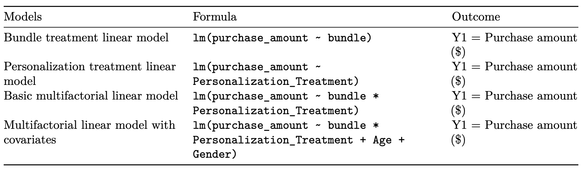
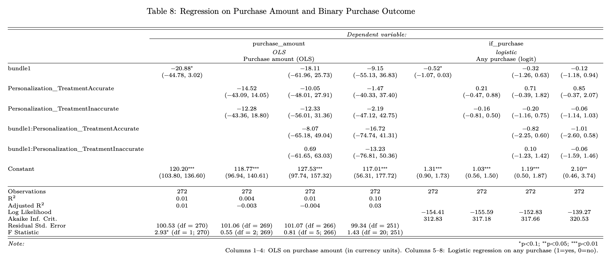

# Causal Experimental Study on Product Personalization and Bundling

> A randomized 3x2 factorial experiment across 272 participants testing whether identity-based product personalization amplifies the effect of bundling on consumer spending in a simulated e-commerce environment.

[]()
[]()

---

## Overview

This study applies a 3x2 factorial experiment to test whether identity-based personalization amplifies the effectiveness of product bundling on consumer spending in a simulated digital commerce environment. Using Qualtrics, 272 US-based participants were randomly assigned to one of six purchase conditions varying across three levels of personalization and two bundling states. Contrary to expectations, no statistically significant differences in spending emerged across conditions. This finding that points to the complex psychological and contextual factors that mediate the effectiveness of digital marketing strategies.

## Table of contents

- [Data](#data)
- [File structure](#file-structure)
- [Setup & reproduction](#setup--reproduction)
- [Methods](#methods)
- [Results](#results)
- [Key learnings](#key-learnings)
- [Contributors](#contributors)

## Data

| Dataset | Source | Description |
|---------|--------|-------------|
| data.csv | [data](data/data.csv) | Anonymized survey data from Qualtrics with 272 participants |

### Data Column Dictionary

| Column | Type | Description |
|--------|------|-------------|
| `StartDate` / `EndDate` | datetime | Qualtrics survey start and end timestamps |
| `Duration..in.seconds.` | integer | Time taken to complete the survey in seconds |
| `Finished` | boolean | Whether the participant completed the survey |
| `ResponseId` | string | Unique Qualtrics identifier per respondent |
| `Q_RecaptchaScore` | float | Bot-detection score (1.0 = human, 0.0 = bot) |
| `Age` | categorical | Age range of the participant (e.g. 18–24, 25–34) |
| `Gender` | categorical | Self-reported gender |
| `Q15` | categorical | Household income bracket |
| `Q5` | categorical | Participant's selected activity preference |
| `Q7` | categorical | Participant's selected life priority |
| `Q44` | string | Participant's selected image that relates to them |
| `TravelScore` / `FitnessScore` / `FamilyScore` / `WorkScore` / `LeisureScore` | integer | Lifestyle affinity scores derived from survey responses |
| `top_lifestyle` | categorical | The lifestyle category with the highest affinity score for that participant |
| `max_lifestyle_value` | integer | The score value of the top lifestyle category |
| `PresentationType` | categorical | Experimental condition — combination of personalization level and bundling type (e.g. `Accurate_Bundle`, `Generic_Individual`, `Inaccurate_Bundle`) |
| `personalization` | categorical | Participant's self-reported perception of personalization (`Not at all`, `A little`, `Definitely`) |
| `purchases` | string | Item(s) selected by the participant and their prices |
| `purchase_amount` | float | Total dollar amount of items selected — the primary outcome variable |
| `bundle` / `individual` | binary | Indicator flags for the bundling condition (1 = assigned to that condition) |
| `accurate` / `generic` / `inaccurate` | binary | Indicator flags for the personalization condition (1 = assigned to that condition) |
| `confirmation` | categorical | Whether the participant confirmed reading the product page |
| `CompleteFlag` | boolean | Internal flag marking fully valid responses used in analysis |

## File structure

```
├── data/           # processed survey dataset
├── notebooks/      # analysis notebooks
├── images/         # charts and figures used in the README
├── docs/           # final report markdown and PDF
├── README.md
└── requirements.R
```

## Setup & reproduction

```bash
# Clone the repo
git clone https://github.com/jandersen12/Causal-Experiment-Product-Marketing.git
cd Causal-Experiment-Product-Marketing

# Install dependencies
source("requirements.R")    # R

# Run notebooks
# power-analysis.Rmd -> run notebook to see the estimated power for the experiment
# experiment-analysis.Rmd -> run notebook to see pre-report data analysis
# final-report.Rmd -> run notebook to see final analysis and report

```

> **Environment:** R 4.3.

## Methods

Using a 3x2 factorial design, we randomly assigned 272 US-based participants into one of 6 purchase environment conditions, varying in personalization and bundling. The Xs below indicate the treatment that each group would receive:

- Group 1 (R ):No bundle, no personalization
- Group 2 (R, X1): Bundled, no personalization
- Group 3 (R, X2): No bundle, Accurate Personalization
- Group 4 (R, X3): No bundle, Inaccurate Personalization
- Group 5 (R, X1,X2): Bundled, Accurate Personalization
- Group 6 (R, X1, X3): Bundled, Inaccurate Personalization

Our shopping environment featured six consumer technology products, selected for their broad appeal, gender neutrality, and price variability (ranging from $24 to $129). These products included:

- Apple AirPods 4 ($129.00)
- Anker Portable Charger ($54.99)
- Roku Streaming Stick 4K ($46.99)
- Tile by Life360 Pro ($34.99)
- HD Mini Projector ($59.99)
- JBL Clip 5 Speaker ($79.95)

Our two outcome measures were (1) purchase amount and (2) purchase made (binary yes/no). We hypothesized that both personalization and bundling would independently increase total spending and that their combination would also produce a positive effect on spending.

📄 [Full report (PDF)](docs/FINAL-REPORT.pdf)

## Results

For modeling the results, we fit four models to compare purchase amount outcomes. The exact formulas are listed in the image below, and the main results can be seen in table 8. This table shows that the outcomes do not provide statistically significant evidence to reject the null hypotheses of the study. That is, neither identity-based personalization, product bundling, nor their interaction had a detectable effect on total purchase amounts in our study





## Key learnings

- Conducting this experiment introduced me to the challenges of designing a causal experiment in a semi-controlled environment that would capture the necessary data and allow me to make statistically sound comparisons between groups.
- Limitations to this study included a small sample size and a simulated purchasing environment, which measures intent to purchase rather than actual purchase amounts. However, the study provided valuable experience in experimental design, execution, recruitment, and rigorous statistical analysis. 

## Contributors

Maia Kennedy | Indri Adisoemarta | Jane Li

UC Berkeley MIDS | July 2025
